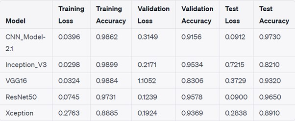

# Galaxy Image Classification Project

The Galaxy Image Classification Project aims to develop an automated system for classifying galaxy images using deep learning techniques. By analyzing the visual characteristics and patterns of galaxies captured in images, we can categorize them into different classes, providing valuable insights into their types and properties. Traditionally, galaxy classification required manual analysis by experts, which was time-consuming and subject to human biases. With the advancements in deep learning, we can now leverage powerful neural network models to automate this process and potentially achieve more accurate results.
## Project Overview

In this project, I will explore and compare various deep learning models for galaxy image classification. I will train these models on a labeled dataset of galaxy images, where each image is associated with a specific class representing the type of galaxy it belongs to. The dataset will be divided into training, validation, and testing subsets to ensure proper evaluation of the models.

The main objective of this project is to evaluate the performance of different deep learning architectures and determine the most effective model for galaxy image classification. We will consider factors such as training accuracy, validation accuracy, and test accuracy to assess the models' performance. Additionally, we will generate other metrics such as precision, recall, and F1-score to gain a comprehensive understanding of the models' classification capabilities.

## Dataset

The Galaxy Zoo dataset is a rich collection of galaxy images along with associated probabilities for different morphology classifications. It provides valuable insights into the characteristics and features of galaxies. Here is some information about the dataset:

#### Number of Images :
The dataset contains a large number of galaxy images. The exact number of images may vary based on the specific version or subset of the dataset used. However, the Galaxy Zoo dataset typically includes tens of thousands or even hundreds of thousands of galaxy images.

#### Features: 
The dataset includes a set of probabilities associated with various morphology classifications for each galaxy image. These probabilities represent the likelihood of a galaxy falling into different categories based on its shape and characteristics. The features in the dataset include:

   ```Class1.1: Probability of being a smooth galaxy
   Class1.2: Probability of having features/disk
   Class1.3: Probability of being a star/artifact
   Class2.1: Probability of being an edge-on galaxy
   Class2.2: Probability of not being edge-on
   Class3.1: Probability of having a bar
   Class3.2: Probability of not having a bar
   Class4.1: Probability of having a spiral pattern
   Class4.2: Probability of not having a spiral pattern
   Class5.1 to Class5.4: Probabilities for the prominence of the central bulge
   Class6.1: Probability of having an "odd" feature
   Class6.2: Probability of not having an "odd" feature
   Class7.1 to Class7.3: Probabilities for the roundness of smooth galaxies
   Class8.1 to Class8.7: Probabilities for different types of odd features
   Class9.1 to Class9.3: Probabilities for the shape of the bulge in edge-on galaxies
   Class10.1 to Class10.3: Probabilities for the tightness of the spiral arms
   Class11.1 to Class11.6: Probabilities for the number of spiral arms
```
These features provide a detailed characterization of galaxy morphology and enable researchers to study the diverse properties and structures exhibited by galaxies in the dataset.

The Galaxy Zoo dataset serves as a valuable resource for conducting research, developing models, and exploring the intricate nature of galaxies. Its extensive collection of images and associated probabilities facilitates the understanding of galaxy formation, evolution, and classification.
## Model Performace 


## Models Used

This project utilizes several deep learning models for galaxy image classification:

1. CNN_Model-2.1:
   - Architecture: Custom CNN model with multiple convolutional and pooling layers.
   

2. Inception_V3:
   - Architecture: Pretrained InceptionV3 model with weights initialized from ImageNet.
   

3. VGG16:
   - Architecture: Pretrained VGG16 model with weights initialized from ImageNet.
   

4. ResNet50:
   - Architecture: Pretrained ResNet50 model with weights initialized from ImageNet.
   

5. Xception:
   - Architecture: Pretrained Xception model with weights initialized from ImageNet.
   

<!--## Getting Started

To run this project on your local machine, follow these steps:

1. Clone the repository: `git clone https://github.com/your_username/galaxy-classification.git`
2. Install the required dependencies: `pip install -r requirements.txt`
3. Download the dataset and place it in the `data/` directory.
 4. Run the desired model script, such as `python cnn_model.py` or `python inception_v3.py`.

Feel free to explore and modify the code to suit your needs. Happy classifying! -->
## Future Work

Here are some potential research directions and analysis I could consider for My research thesis:

- [x] **Performance comparison**: Compare the performance of your CNN model with other popular models or architectures on the same dataset. Evaluate metrics such as accuracy, precision, recall, F1 score, or area under the curve (AUC). Analyze the strengths and weaknesses of different models and discuss the implications of your findings.

- [ ] **Hyperparameter optimization**: Perform a comprehensive hyperparameter tuning process to find the optimal combination of hyperparameters for the CNN model. Explore techniques like grid search, random search, or Bayesian optimization. Discuss the impact of different hyperparameters on model performance and highlight the best configurations.

- [ ] **Transfer learning analysis**: Investigate different pre-trained models and compare their performance when used as a starting point for transfer learning. Assess the effects of freezing different layers, fine-tuning specific layers, or modifying the architecture of the pre-trained model. Discuss the trade-offs between using pre-trained models and training from scratch.

- [ ] **Data analysis**: Conduct an in-depth analysis of the dataset you're working with. Explore the distribution of classes, identify any class imbalances, and investigate the impact of data augmentation techniques on model performance. Analyze the relationship between different features or attributes in the dataset and their influence on model predictions.

- [ ] **Interpretability and explainability**: Explore techniques to interpret and explain the predictions made by the CNN model. Consider methods such as saliency maps, class activation maps, or feature visualization to understand which parts of the image are most important for predictions. Discuss the interpretability of the models and its implications for real-world applications.

- [ ] **Robustness analysis**: Assess the robustness of the CNN model to different types of adversarial attacks or perturbations. Investigate methods such as adversarial examples, input transformations, or gradient-based attacks to evaluate the model's vulnerability. Discuss strategies for improving the model's robustness against these attacks.

- [ ] **Model compression and deployment**: Investigate techniques for model compression to reduce the size of the CNN model without significant loss in performance. Consider methods like pruning, quantization, or knowledge distillation. Additionally, explore approaches for deploying the CNN model on resource-constrained devices or in real-time applications.

- [ ] **Domain adaptation and generalization**: Extend your research to evaluate the generalization capability of the CNN model across different domains or datasets. Explore techniques for domain adaptation or transfer learning to improve the model's performance when applied to new, unseen data. Discuss the challenges and potential solutions for domain adaptation in the context of the research.

- [ ] **Explainability and fairness**: Examine the ethical implications of the CNN model and investigate fairness metrics to assess any biases or discrimination in the model's predictions. Explore methods for mitigating biases and ensuring fairness in the decision-making process of the model. Discuss the importance of ethical considerations in the development and deployment of AI models.

- [ ] **Comparative analysis with non-deep learning methods**: Compare the performance of the CNN model with traditional machine learning algorithms or other non-deep learning approaches. Consider classical image processing techniques, feature engineering, or other algorithms specific to the research problem. Analyze the advantages and limitations of deep learning compared to these methods.


